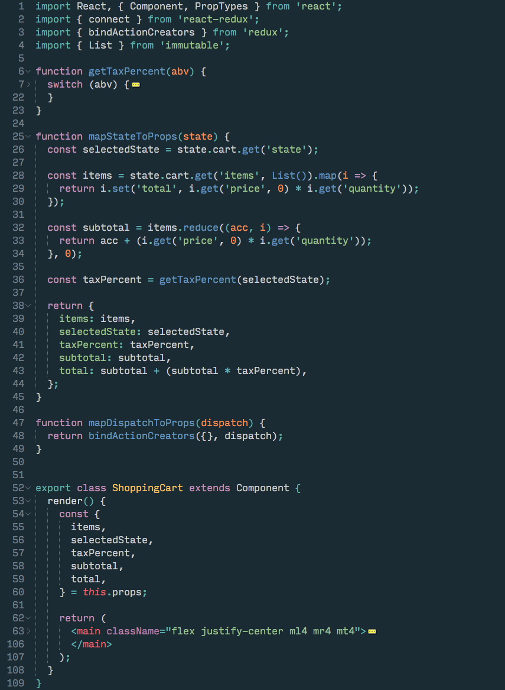
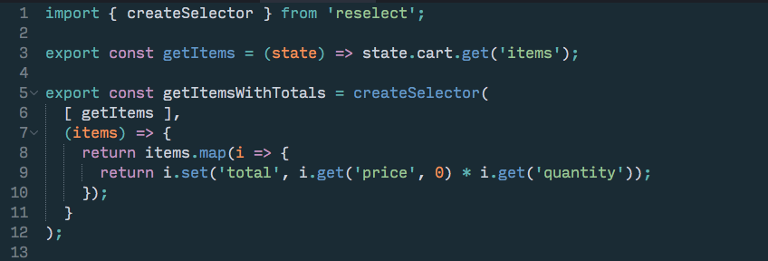
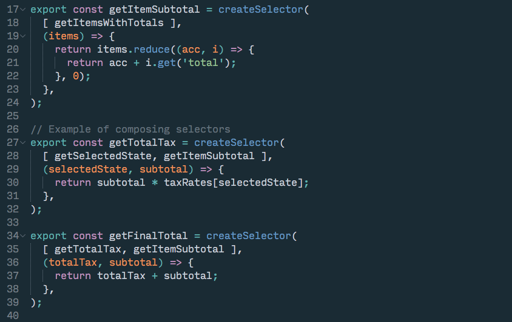
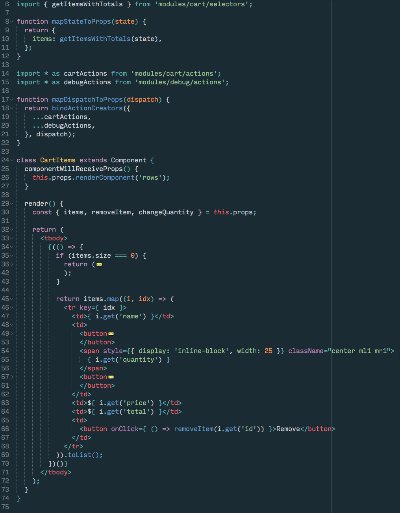

## Improving React + Redux performance with Reselect

React & Redux serves as an awesome combination of technologies that really helps us structure our applications in such a way that we have true separation of concerns. And although React is extremely performant out of the box, there comes a time when even higher performance is required.

One of the more expensive operations that React can perform is the rendering cycle. When a component detects a change in input, this render cycle is triggered. Depending on how complex the operation is, this can be very expensive.

When we first get started with React, we typically don’t worry about how costly these render cycles are. But as our UIs grow in complexity, we need to start concerning ourselves with them. React offers us some tools to hijack the render cycle and prevent re-rendering if we deem it not needed. To do this, we would tap into the componentShouldUpdate lifecycle event, and return a boolean whether or not the component should update. This is the basis of the PureRenderMixin, it compares the incoming props and state with the previous props and state, and returns false if equality passes.

This coupled with Immutable datasets provides us quite a substantial performance improvement as we can easily determine if a component should re-render or not. But this only goes so far.

Consider the following problem: We are building a shopping cart, with 3 types of input: items in the cart, the quantity of those items, and the applicable tax (based on state or province). The problem here is that whenever any of the state is modified (a new item is added, a quantity is changed, or the selected state is changed), everything needs to be re-calculated, and re-rendered. If we had hundred of items in our cart, changing the tax percentage would trigger a re-calculation of the items in the cart. But it shouldn’t, because that is simply a change in the derived data, only the total, and tax total should change and trigger subsequent updates. Let’s look at how we can fix these problems.

## Reselect to the rescue

Reselect is a library for building memoized selectors. We define selectors as the functions that retrieve snippets of the Redux state for our React components. Using memoization, we can prevent unnecessary re-renders and recalculations of derived data which in turn will speed up our application.

Consider the following example:

If we had several hundred, or thousand items, re-rendering all the items might be expensive if only the tax-percentage changes. What if we implemented a search, should we have to re-calculate the items and their taxes over and over again every time the user searched their cart? We can prevent these costly operations by moving them to use memoized selectors. With memoized selectors, if the state tree is large, we don’t have to worry about expensive calculations being performed every time the state changes. We can also add additional flexibility to our frontend by breaking these out into individual components.

Let’s look at a simple selector using Reselect:

We’ve broken our cart item retrieval function into two functions now. The first one (Line 3) will simply get all the items in the cart, and then the second one represents a memoized selector. Reselect exposes the createSelector API which allows us to build a memoized selector. What this means is that getItemsWithTotals will be calculated the first time the function runs, if the same function is called again, but the input (the result of getItems) has not changed, the function will simply return a cached calculation of the items and their totals. If the items are modified (e.g. an item is added, a quantity is changed, anything that manipulates the result of getItems), then the function will be executed again.

This is a powerful concept, as it allows us to completely optimize which components should be rerendered, and when their derived state should be recalculated. This means we no longer have to worry about getItems and subsequently the total cost of each item being calculated when operations that don’t impact their state are performed.

We can continue this trend by creating selectors for all of our derived data. This includes the subtotal calculation, the total tax calculation, and the final total:

## Making use of a selector

With our selectors in place, let’s now look at how we can take advantage of the `getItemsWithTotals` selector in one of our components:

We now have a component that only understands about the items in the cart. This is a nice approach because it does not have to concern itself with totals, subtotals, etc. While it is not the most useful component for reuse, it is a performant component. Changes that it does not concern itself with (e.g. changes to the tax calculation), will not cause additional re-renders.

Applying this approach across the rest of the shopping cart means we will have a component that is responsible for displaying the subtotal, total, and tax calculation.

Making these optimizations early in your application means less work in the future when you need to correct performance problems. I recommend moving to using reselect as soon as possible. One of the major benefits of moving our selectors our of our components means that we can easily test these derived data calculations just as we would any other JavaScript function. We simply mock our Redux state and then check for the expected output based on the state provided.

For a further demonstration of these concepts, refer to the demo here: https://github.com/neilff/react-redux-performance

